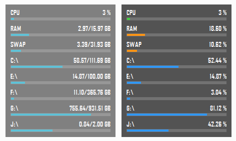

# SysMeter by jNizM
Shows ComputerInfo via AutoHotkey

  
## Features
* Shows CPU Usage
* Shows RAM & SWAP Usage
* Shows Drives Usage
* Toggle MB/GB to Percentage
* Toggle Transparency
* Toggle AlwaysOnTop

## Screenshot

## Info
* Version: v0.1
* URL: [AHK Thread](http://ahkscript.org/boards/viewtopic.php?f=6&t=3521)

## Changelog
* 0.1 | First Release

## Contributing
* thanks to SKAN for CPULoad() function
* thanks to AutoHotkey Community
