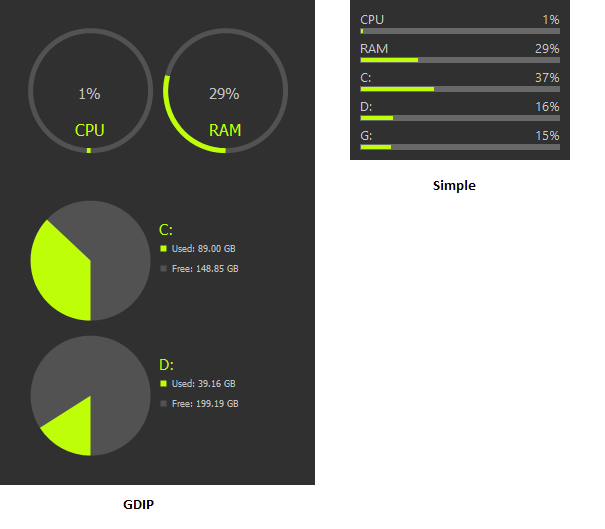

# SysMeter by jNizM
Shows ComputerInfo via AutoHotkey

  
## Features
* Shows Date, Time & Uptime (Toggle)
* Shows CPU Usage
* Shows RAM & SWAP Usage
* Shows Drives Usage
* Toggle MB/GB to Percentage
* Toggle & Reset Transparency
* Toggle AlwaysOnTop
* Color Scheme
* Save Ini-Settings
* Reload Gui on Device Changes

## Screenshot

## Info
* Version: AHK v2
* URL: [AHK Thread](https://www.autohotkey.com/boards/viewtopic.php?f=83&t=94947)
* Version: AHK v1.1 (OLD)
* URL: [AHK Thread](https://www.autohotkey.com/boards/viewtopic.php?f=6&t=3521)

## Changelog
* NEW 0.1 | First v2 Release
* 0.6 | Added toggle date, time & uptime; Added reload on device change
* 0.5 | Some fixes; AlwaysOnTop now in saved .ini
* 0.4 | Change text; Added Color Scheme
* 0.3 | Save & Load Ini-Settings
* 0.2 | Scale transparency with Strg+MWHEEL(UP|DOWN)
* 0.1 | First Release

## Contributing
* thanks to SKAN for CPULoad() function
* thanks to AutoHotkey Community